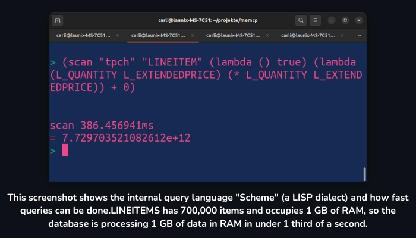
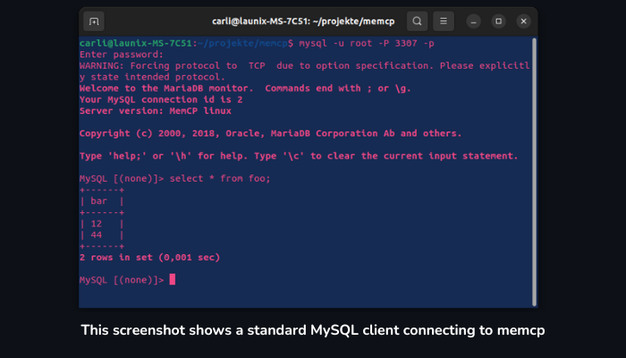

<h1 align="center">memcp: A High-Performance, Open-Source Columnar In-Memory Database </h1>
<h4 align="center">Protocol compatible drop-in replacement for MySQL</h4>

<div align="center">


 


 
 

<br>


<h1 align="center">Introduction</h1>

<b>In modern server and mainframe hardware, the memory bandwidth between CPU and RAM has become the new bottleneck. In-RAM compression will be a mayor contribution towards solving that issue.</b>

### What is memcp?
memcp is an open-source, high-performance, columnar in-memory database that can handle both OLAP and OLTP workloads. It provides an alternative to proprietary analytical databases and aims to bring the benefits of columnar storage to the open-source world.

###
memcp is written in Golang and is designed to be portable and extensible, allowing developers to embed the database into their applications with ease. It is also designed with a focus on scalability and performance, making it a suitable choice for distributed applications.

</div>

<br>

### Features
- <b>fast:</b> MemCP is built with parallelization in mind. The parallelization pattern is made for minimal overhead.
- <b>efficient:</b> The average compression ratio is 1:5 (80% memory saving) compared to MySQL/MariaDB
- <b>modern:</b> MemCP is built for modern hardware with caches, NUMA memory, multicore CPUs, NVMe SSDs
- <b>versatile:</b> Use it in big mainframes to gain analytical performance, use it in embedded systems to conserve flash lifetime
- Columnar storage: Stores data column-wise instead of row-wise, which allows for better compression, faster query execution, and more efficient use of memory.
- In-memory database: Stores all data in memory, which allows for extremely fast query execution.
- Build fast REST APIs directly in the database (they are faster because there is no network connection / SQL layer in between)
- OLAP and OLTP support: Can handle both online analytical processing (OLAP) and online transaction processing (OLTP) workloads.
- Compression: Lots of compression formats are supported like bit-packing and dictionary encoding
- Scalability: Designed to scale on a single node with huge NUMA memory
- Adjustable persistency: Decide whether you want to persist a table or not or to just keep snapshots of a period of time

<hr>

<h1 align="center"> Screenshots </h1>


<div align="center">



<br>



</div>

<hr>

<h1 align="center">Getting Started 🚶</h1>

<h2>Using Docker</h2>

```
# first time: build the image
docker build -t memcp

# run with the interactive scheme shell for debugging and development
docker run -it -p 4321:4321 -p 3307:3307 memcp

# run a specific application
docker run -it -p 4321:4321 -p 3307:3307 memcp ./memcp apps/bayesian.scm

# run for productive use
docker run -di -p 4321:4321 -p 3307:3307 --restart unless-stopped memcp


```

<h2>Compile From Source</h2>

Make sure, `go` is installed on your computer.

Compile the project with

```
make # executes go build
```

Run the engine with

```
./memcp
```

<h2>MemCP Scheme Shell</h2>

It will drop you at the scheme shell:

<pre><span style="color: #12488B"><b>~/memcp</b></span>$ ./memcp
memcp Copyright (C) 2023   Carl-Philip Hänsch
    This program comes with ABSOLUTELY NO WARRANTY;
    This is free software, and you are welcome to redistribute it
    under certain conditions;
Welcome to memcp
Hello World
MySQL server listening on port 3307 (connect with mysql -P 3307 -u user -p)
listening on http://localhost:4321
<span style="color: #26A269">&gt;</span>  
</pre>

now you can type any scheme expression like:

<pre><span style="color: #26A269">&gt;</span> (+ 1 2)
<span style="color: #C01C28">=</span> 3
<span style="color: #26A269">&gt;</span> (&#42; 4 5)
<span style="color: #C01C28">=</span> 20
<span style="color: #26A269">&gt;</span> (show) /* shows all databases */
<span style="color: #C01C28">=</span> ()
<span style="color: #26A269">&gt;</span> (createdatabase &quot;yo&quot;)
<span style="color: #C01C28">=</span> &quot;ok&quot;
<span style="color: #26A269">&gt;</span> (show) /* shows all databases */
<span style="color: #C01C28">=</span> (&quot;yo&quot;)
<span style="color: #26A269">&gt;</span> (show &quot;yo&quot;) /* shows all tables */
<span style="color: #C01C28">=</span> ()
<span style="color: #26A269">&gt;</span> (rebuild) /* optimizes memory layout */
<span style="color: #C01C28">=</span> &quot;124.503µs&quot;
<span style="color: #26A269">&gt;</span> (stat) /* memory usage statistics */
<span style="color: #C01C28">=</span> &quot;Alloc = 0 MiB	TotalAlloc = 1 MiB	Sys = 16 MiB	NumGC = 1&quot;
<span style="color: #26A269">&gt;</span> (loadCSV &quot;yo&quot; &quot;customers&quot; &quot;customers.csv&quot; &quot;;&quot;) /* loads CSV */</pre>

<h2>MySQL Connection</h2>

connect to it via

```bash
mysql -u root -p -P 3307 # password is 'admin'
```

You can try queries like:
```sql
SHOW DATABASES
SHOW TABLES
CREATE TABLE foo(bar string, amount int)
INSERT INTO foo(bar, amount) VALUES ('Man', 4), ('Horse', 6)
SELECT * FROM foo
SELECT SUM(amount) FROM foo
```

If you want to import whole databases from your old MySQL or MariaDB database, do the following:
```
$ ./tools/mysqldump-to-json.py -H localhost -u [user] -p [password] [database] > dump.jsonl
$ ./memcp
memcp Copyright (C) 2023   Carl-Philip Hänsch
    This program comes with ABSOLUTELY NO WARRANTY;
    This is free software, and you are welcome to redistribute it
    under certain conditions;
Welcome to memcp
Hello World
MySQL server listening on port 3307 (connect with mysql -P 3307 -u user -p)
listening on http://localhost:4321
> (createdatabase "my_database")
"ok"
> (loadJSON "my_database" "dump.jsonl")
"1.454ms"
```

<h2>REST API</h2>

```bash
curl --user root:admin 'http://localhost:4321/sql/system/SHOW%20DATABASES'
curl --user root:admin 'http://localhost:4321/sql/system/SHOW%20TABLES'
curl --user root:admin 'http://localhost:4321/sql/system/SELECT%20*%20FROM%20user'
```

<hr>
<h1 align="center">Securing the database from external access 🔒</h1>
The standard username/password is root/admin. To change that, type the following into scheme console:

```
(eval (parse_sql "" "ALTER USER root IDENTIFIED BY 'new_password'"))
(eval (parse_sql "" "CREATE USER user2 IDENTIFIED BY 'new_password'"))
```

<hr>

<h1 align="center">Example REST API App 📕</h1>

You can host your own REST APIs directly from the database. You can plug your services into the database as scheme modules. They will offer REST endpoints on the database's builtin HTTP server.

We made an example application that hosts a bayesian text classifier. You can use that app to do spam detection, AI-enhanced automated accounting and much more. A bayesian text classifier learns from example and then applies statistical correlations to generalize and classify unknown texts as well.

To test it, just type:

```
./memcp apps/bayesian.scm
```

now you can use the Bayesian text classifier under http://localhost:4321/bayes/ as a REST service

```
curl 'http://localhost:4321/bayes/i am a booking text?account=4001' # will learn the text to be account=4001
curl 'http://localhost:4321/bayes/i am a booking text?classify=account' # will return 4001
```

<hr>

<h1 align="center">Contributing 🌿</h1>

<p align="center"> We welcome contributions to memcp. If you would like to contribute, please follow these steps:, </p>

- Fork the repository and create a new branch for your changes.
- Make your changes and commit them to your branch.
- Push your branch to your fork and create a pull request.

<p align="center"> Before submitting a pull request, please make sure that your changes pass the existing tests and add new tests if necessary. </p>

<hr>

<h1 align="center">How it Works? ❓</h1>

- MemCP structures its data into databases and tables
- Every table has multiple columns and multiple data shards
- Every data shard stores ~64,000 items and is meant to be processed in ~100ms
- Parallelization is done over shards
- Every shard consists of two parts: main storage and delta storage
- main storage is column-based, fixed-size and is compressed
- Delta storage is a list of row-based insertions and deletions that is overlaid over a main storage
- `(rebuild)` will merge all main+delta storages into new compressed main storages with empty delta storages
- every dataset has a shard-local so-called `recordId` to re-identify a dataset


<h1 align="center">Available column compression formats 📃</h1>

- uncompressed & untyped: versatile storage with JSON-esque freedom
- bit-size reduced integer storage with offset: savings of 80% and more for small integers
- integer sequences: >99% compression ratio possible with ascending IDs
- string-storage: more compact than C strings, cache-friendly 
- string-dictionary: >90% memory savings for repeating strings like (male, female, male, male, male)
- float storage
- sparse storage: efficient with lots of NULL values

the best suitable compression technique for a column is detected for a column <b>automatically</b>

<hr>

<h1 align="center">Frequently Asked Questions 🤔</h1>

### What is an in-memory database?
Unlike traditional databases, which store data on disks, in-memory databases (IMDBs) keep data in RAM. This results in much faster access times.

### Why it is used?
An in-memory database (IMDB) stores and retrieves data primarily in a computer's RAM, enabling exceptionally fast data processing and retrieval, making it suitable for real-time applications requiring rapid access to data.

### What are the benefits of columnar storage?
With columnar storage, data is much more homogeneous than in row-based storage. This enables a technique called "column compression" where compression ratios of around 1:5 (i.e. 80% savings) can be achieved just by a different data representation. This reduces the amount of cache lines that must be transferred from main memory to CPU and thus increases performance, reduces power consumption and decreases latency.

Also, columnar storages are a better fit for analytical queries where only a few out of possibly hundreds of columns are processed in the SQL query. An example of an analytical query is calculating the sum of revenue over a timespan from a lot of data points.

### Can in-memory databases be used for my web project?
Yes. MemCP is meant as a drop-in replacement for MySQL and will make your application run faster.

### Why does MemCP consume less RAM than MySQL even though MySQL is a hard disk-based database
In order to run fast, MySQL already has to cache all data in RAM. However, MySQL is not capable of compression, so it will consume about 5x the amount of RAM compared to MemCP for the same size of data cache.

### Isn't it dangerous to keep all data in RAM? What happens during a crash?
MemCP of course supports some kind of hard disk persistency. The difference to a hard-disk-based database is that in MemCP you can choose how much IO bandwidth you want to sacrifice to achieve full crash safety. In other words: Your accounting data can still be secured with per-transaction write barriers while you can increase the write performance for sensor data by loosening persistency guarantees.

### What happens if memory is full?
Usually, the net amount of data in databases is very low. You will be amazed, at how much data fits into your RAM when properly compressed. If that still exceeds the memory of your machine, just remember how slow it would be on the hard disk. Upgrade your RAM if you don't want to be on your swap partition.


### What's the current development status of MemCP?
We are still in the early alpha phase. MemCP already supports some basic SQL statements but it is not production-ready yet. The best way to use MemCP in a productive environment is over the internal scheme scripting language where you can hand-craft efficient query plans. Contribution to the SQL compiler is of course welcome.

### What are MemCP REST services?
Normally, REST applications are implemented in any programming language, make a connection to an SQL server and do their queries. This induces IO overhead for that additional network layer between application and database and for the string-print-send-receive-parse pipeline. With MemCP, you can script MemCP to open a REST server and offer your REST routes directly in the process space of the database. You can prepare SQL statements which can be directly invoked inside the database. And don't be afraid of crashes: a crash in MemCPs scheme scripts will never bring down the whole database process.

<hr>

<h1 align="center">Further Reading 📚</h1>

- [VLDB Research Paper](https://www.vldb.org/pvldb/vol13/p2649-boncz.pdf)
- [LNI Proceedings Paper](https://cs.emis.de/LNI/Proceedings/Proceedings241/383.pdf)
- [TU Dresden Research Paper](https://wwwdb.inf.tu-dresden.de/wp-content/uploads/T_2014_Master_Patrick_Damme.pdf)
- [Large Graph Algorithms](https://www.dcs.bbk.ac.uk/~dell/teaching/cc/paper/sigmod10/p135-malewicz.pdf)

- [Balancing OLAP and OLTP Workflows](https://launix.de/launix/how-to-balance-a-database-between-olap-and-oltp-workflows/)
- [Designing Programming Languages for Distributed Systems](https://launix.de/launix/designing-a-programming-language-for-distributed-systems-and-highly-parallel-algorithms/)
- [Columnar Storage Interface in Golang](https://launix.de/launix/on-designing-an-interface-for-columnar-in-memory-storage-in-golang/)
- [Impact of In-Memory Compression on Performance](https://launix.de/launix/how-in-memory-compression-affects-performance/)
- [Memory-Efficient Indices for In-Memory Storages](https://launix.de/launix/memory-efficient-indices-for-in-memory-storages/)
- [Compressing Null Values in Bit-Compressed Integer Storages](https://launix.de/launix/on-compressing-null-values-in-bit-compressed-integer-storages/)
- [Improving Golang HTTP Server Performance](https://launix.de/launix/when-the-benchmark-is-too-slow-golang-http-server-performance/)
- [Benchmarking SQL Databases](https://launix.de/launix/how-to-benchmark-a-sql-database/)
- [Writing a SQL Parser in Scheme](https://launix.de/launix/writing-a-sql-parser-in-scheme/)
- [Accessing memcp via Scheme](https://launix.de/launix/accessing-memcp-via-scheme/)
- [First SQL Query in memcp](https://launix.de/launix/memcp-first-sql-query-is-correctly-executed/)
- [Sequence Compression in In-Memory Database](https://launix.de/launix/sequence-compression-in-in-memory-database-yields-99-memory-savings-and-a-total-of-13/)
- [Storing Data Smaller Than One Bit](https://launix.de/launix/storing-a-bit-smaller-than-in-one-bit/)
- [memcp Announcement Video](https://www.youtube.com/watch?v=DWg4nx4KVLo)
